# Grasp Point Prediction
A Comparative Study of CLIP, Grounding DINO, and Florence-2 for Language-Guided Grasp-Relevant Point Prediction

## 🎯 Project Overview

This repository contains our project investigating **Computer Vision (CV)** by focusing on **Vision-Language Models (VLMs)** - AI systems that process both images and text - for the task of grasp-relevant 2D point prediction.

Every year, millions of elderly and disabled individuals struggle to perform simple activities like picking up a glass of water or retrieving their medication. These are moments that caregivers must drop everything to address which is costing the U.S. healthcare system approximately [$177.5 billion in 2026](https://www.mcknightsseniorliving.com/news/us-healthcare-spending-for-nfs-and-ccrcs-to-reach-337-4-billion-by-2032-cms-says/) and quietly eroding patients' sense of independence and dignity. If a robot could simply listen to a language instruction and act on it precisely the way a human assistant would, it could free caregivers and give people back their autonomy, safety, and quality of life.

However, the deployment of VLMs in assistive robotics involves critical safety risks, as pixel-level miscalculations during physical grasping can result in patient injury. To address this, we aim to move beyond **coarse bounding-box localization** toward predicting **precise (x, y) pixel coordinates** that are meaningful for safe robotic interaction. Our goal is to achieve high-precision, language-guided grasp-relevant point prediction to improve lives and increase productivity. Toward this vision, our project takes a first step by asking a fundamental question: **Can language make a robot not just see an object, but understand how to interact with it the way a human would?**

This project pursues three concrete objectives:

1. **Benchmark** three vision-language architectures - a supervised [CLIP](https://arxiv.org/abs/2103.00020)-based regression head, and two zero-shot models ([Grounding DINO](https://arxiv.org/abs/2303.05499) and [Florence-2](https://arxiv.org/abs/2311.06242)) - on the task of predicting precise (x, y) grasp-relevant pixel coordinates from RGB images alone.
   
2. **Evaluate** whether natural language prompt variation (e.g., *"point to"* versus *"grasp the"*) causes statistically meaningful shifts in predicted interaction points, testing whether these models genuinely understand language or merely respond to visual patterns.

3. **Establish** a reproducible evaluation framework using pixel error, normalized error, and success rate across 48 object categories that future work can build on as models and datasets improve.

We draw on **GraspMoLMo** ([Deshpande et al., 2025](https://arxiv.org/abs/2505.13441)) as a motivating reference, as it demonstrates that natural language instructions can guide semantically meaningful grasp point selection (e.g., grasping a teapot handle vs. its body). While GraspMoLMo relies on RGB-D (depth) input and a large-scale synthetic dataset, our work investigates how much language-guided grasp localization is achievable from **RGB images alone**, using real-world annotations from [PixMo-Points](https://huggingface.co/datasets/allenai/pixmo-points) a deliberate simplification to isolate the role of visual-language grounding without depth sensing.

## 👥 Team Members (CRediT Statement)

* **Priyadarshini Rajmohan** - Conceptualization, Data Curation, Methodology, Formal Analysis, Investigation (CLIP + regressor), Visualization, Writing - Review & Editing.
* **Poojitha Alam** - Conceptualization, Methodology, Formal Analysis, Investigation (GroundingDINO), Visualization, Project Administration, Writing - Review & Editing.
* **Jannine G. D. MacGormain** - Conceptualization, Methodology, Formal Analysis, Investigation (Florence-2), Visualization, Project Administration, Writing - Original Draft

## 📁 Project Structure
```text
data/           ← pixmo_subset_v3 dataset
notebooks/      ← all model training and inference notebooks
outputs/        ← metrics and results
```

## Models Compared
- CLIP
- Grounding DINO  
- Florence-2

## 📁 Dataset
```text
Pixmo subset v3 — images with language-guided grasp point annotations
```

## 🏗️ Technical Environment & Dependencies

Our project's evaluation pipeline and comparative study were made possible by the following architectures, computational frameworks, and open-source libraries:

| Functional Domain | Technologies & Ecosystem |
| :--- | :--- |
| **Evaluated Architectures** | [](https://github.com/openai/CLIP) [](https://github.com/IDEA-Research/GroundingDINO) [](https://huggingface.co/microsoft/Florence-2-large) |
| **Deep Learning Frameworks** | [](https://www.python.org/) [](https://pytorch.org/) [](https://huggingface.co/) |
| **Data Processing & Statistical Analysis** | [](https://numpy.org/) [](https://pandas.pydata.org/) [](https://scipy.org/) |
| **Data Visualization & Reporting** | [](https://matplotlib.org/) [](https://pillow.readthedocs.io/) [](https://www.json.org/) [](https://www.reportlab.com/) |
| **Infrastructure & Version Control**| [](https://colab.research.google.com/) [](https://drive.google.com/) [](https://github.com/) |

### Prerequisites

* **Python** 3.8+
* **CUDA** compatible GPU (Highly recommended for inference/training)
* **Git**

**CLIP**
```bash
!pip install -q torch torchvision transformers pillow matplotlib tqdm
```

```python
MODEL_NAME = "openai/clip-vit-base-patch16"
```

**Grounding DINO**
```bash
!pip -q install "transformers>=4.51,<4.58" "accelerate>=0.30,<1.0" "pillow>=10,<12" matplotlib
```

```python
MODEL_ID = "IDEA-Research/grounding-dino-tiny"
```

**Florence-2**
```bash
!pip install -q transformers==4.49.0 accelerate==0.30.1 einops==0.8.0 datasets pillow matplotlib requests
```

```python
model_id = "microsoft/Florence-2-large"
```

## 🧮 Mathematical Framework

**Standard Performance Metrics:** Prompt sensitivity, prompt consistency, per-category error, and per-prompt error are derived from these base metrics and reported in the aggregate JSON for each model:

**Pixel Error (L2 Norm):** The fundamental accuracy of the spatial grounding task is quantified using the **Euclidean displacement** between the model's **prediction (pred)** and the annotated **ground truth (gt)**. The absolute pixel error is described by:

$$E_{pixel} = \sqrt{(x_{pred} - x_{gt})^2 + (y_{pred} - y_{gt})^2}\tag{1}$$

where $(x_{pred}, y_{pred})$ are the coordinates of the predicted grasp point, and $(x_{gt}, y_{gt})$ are the coordinates of the ground-truth annotation.

**Normalized Pixel Error:** To ensure equitable comparison across varying image resolutions, the **pixel error is normalized** against the **physical dimensions (width $\times$ height) of the image**. The normalized pixel error is described by:

$$E_{norm} = \frac{E_{pixel}}{\sqrt{w^2 + h^2}}\tag{2}$$

where $w$ and $h$ are the width and height of the image, respectively, defining the diagonal length of the spatial domain.

**Success Rate:** The **functional success** of the model's localization is evaluated as a **binary thresholding problem**. The aggregate success rate is described by:

$$S_{rate} = \frac{1}{N} \sum_{i=1}^{N} \mathbf{1}[E_{pixel, i} < \tau]\tag{3}$$

where $N$ is the total number of evaluated samples, $\tau$ is the acceptable pixel error threshold (e.g., `SUCCESS_THRESHOLD = 50`), and $\mathbf{1}[\cdot]$ is the indicator function which equals $1$ if the condition is met and $0$ otherwise.

## Project Architecture

## 📊 Preliminary Results
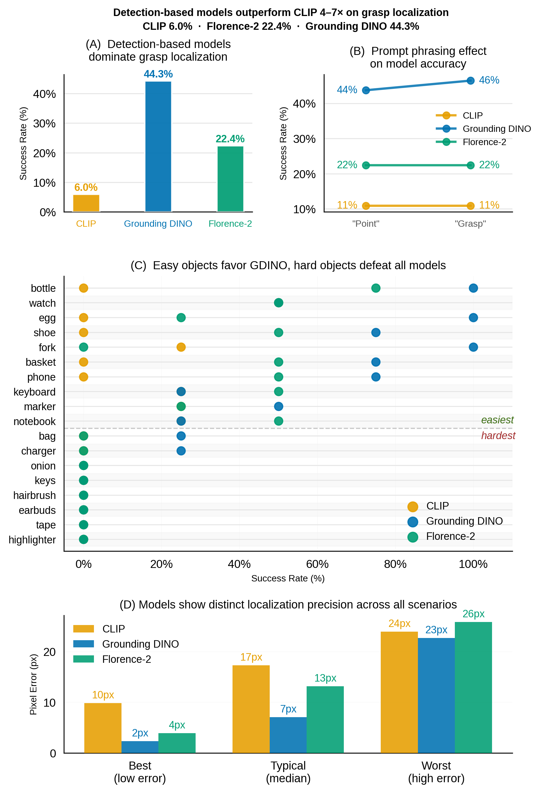

CLIP:
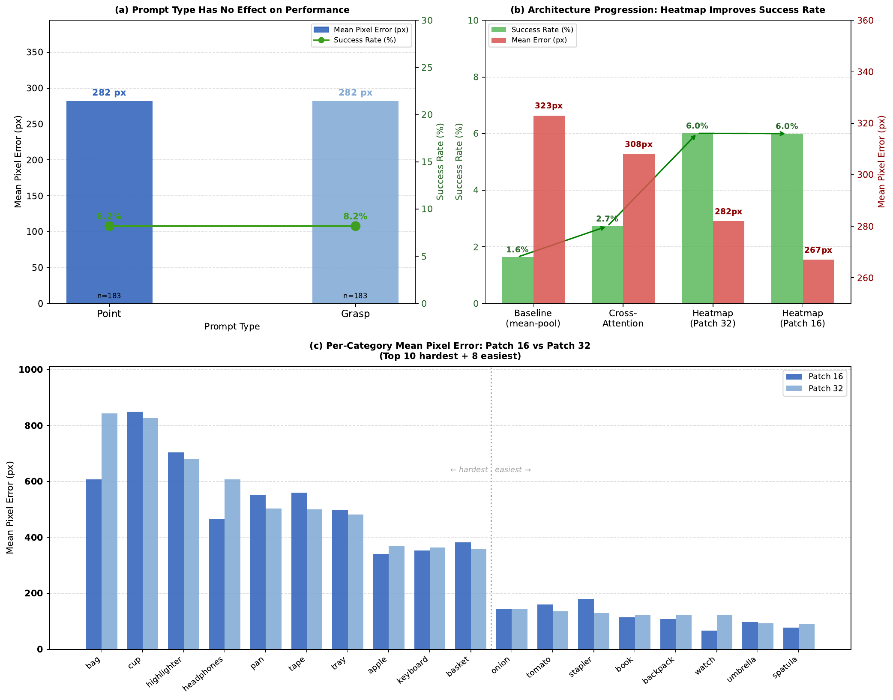

FLORENCE-2:
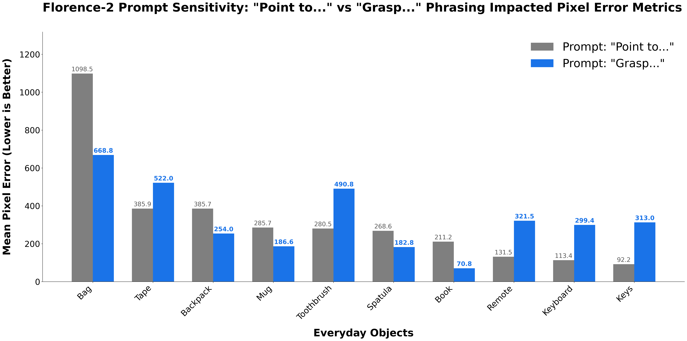

## 📊 Final Report Findings

Our final comparative study builds upon the preliminary data, evaluating the zero-shot spatial localization capabilities of Grounding DINO and Florence-2 against the supervised CLIP baseline across 183 test samples. **Our results demonstrate that spatial pretraining is the fundamental determinant of pixel-precise localization performance.**

### 1. Final Project Architecture

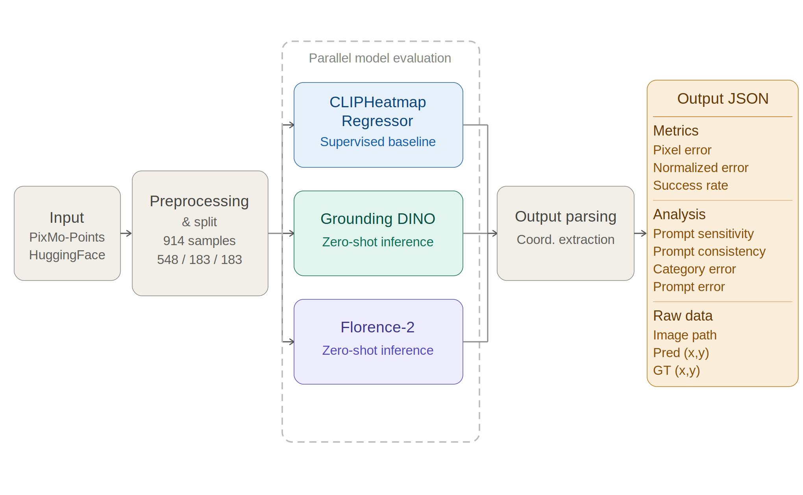

**Figure 1: Unified Evaluation Pipeline.** This diagram illustrates how each input image and natural language label is preprocessed from the PixMo-Points dataset and passed in parallel through all three models, with outputs parsed into a standardized JSON format storing predicted coordinates, pixel error, and derived metrics for comparative analysis.

### 2. Final Model Architectures

**CLIP Architecture:**

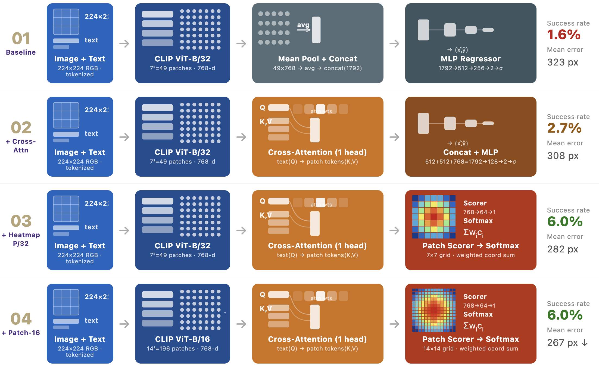

**Figure 2: Four CLIP architecture variants evaluated progressively.** The final design (Arch 04, Patch-16) achieves **6.0%** success rate and 267px mean error, selected as the CLIP baseline for comparative evaluation.

**Florence-2 Architecture:**

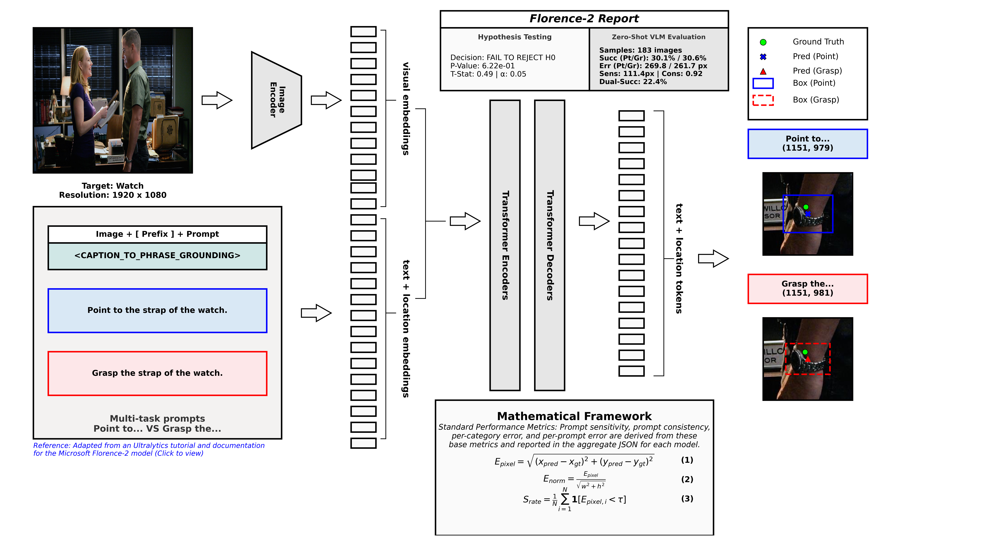

**Figure 3: Architecture and evaluation pipeline for Florence-2 zero-shot grasp point prediction.** The model processes images and text prompts (utilizing the `<CAPTION_TO_PHRASE_GROUNDING>` prefix) into joint embeddings. These are decoded by a sequence-to-sequence transformer into location tokens. Dual-prompting was implemented to evaluate sensitivity. Adapted from Ultralytics [[13]](https://colab.research.google.com/github/ultralytics/notebooks/blob/main/notebooks/how-to-use-florence-2-for-object-detection-image-captioning-ocr-and-segmentation.ipynb).

**Grounding DINO Architecture:**

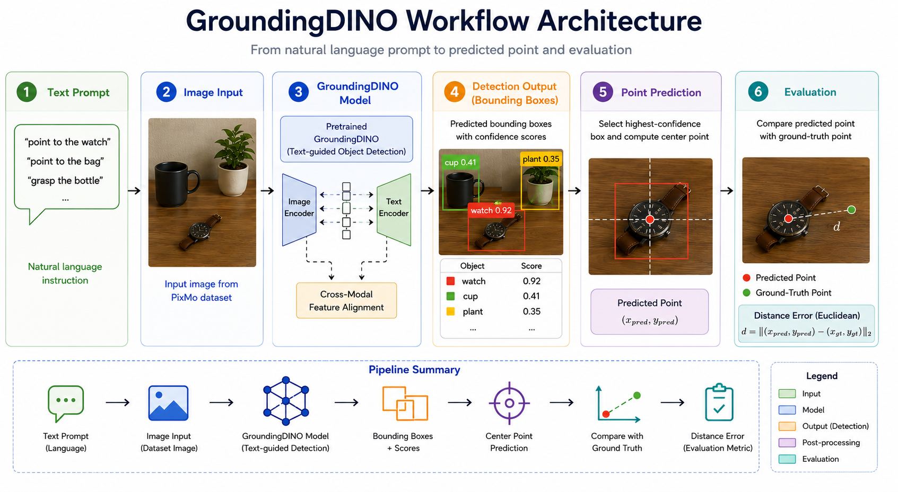

**Figure 4: GroundingDINO-based grasp-point prediction pipeline.** The model takes a text prompt and image as input, detects the prompted object with bounding boxes and confidence scores, and uses the center of the highest-confidence box as the predicted grasp point. Performance is evaluated against the ground-truth point using Euclidean distance.

### 3. Quantitative Evaluation

Our evaluation isolated success rate (at a $\tau = 50$ px threshold), median pixel error, and prompt sensitivity to determine readiness for real-world deployment for robotic manipulation.

**Success Rate & Pixel Error:**

Grounding DINO achieved a dominant **32.8% success rate** with a best-case median error of just **7 px**. In contrast, the generalist sequence-to-sequence Florence-2 model reached **22.4%** (with worst-case errors up to 40px), while a structurally modified spatial-heatmap CLIP baseline achieved only **6.0%** (typical error 17px).

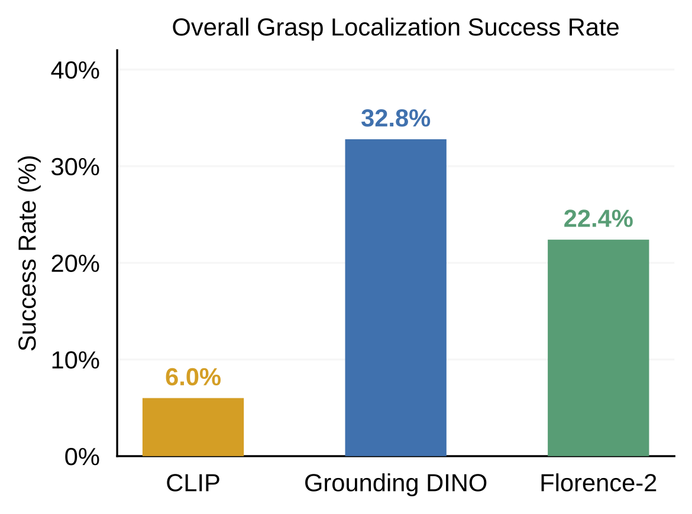

**Figure 5:** Overall grasp point localization success rate for CLIP, Grounding DINO, and Florence-2 on the 183-image test set.

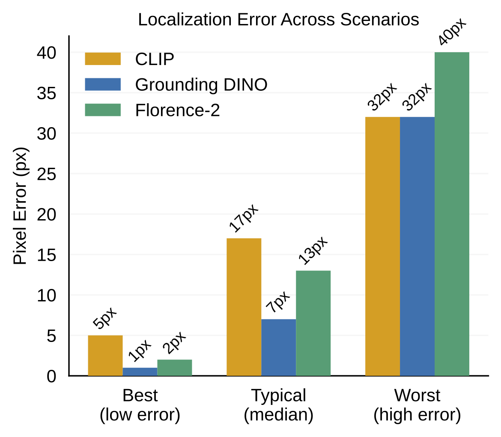

**Figure 6:** Localization pixel error across best, typical, and worst-case prediction scenarios for all three models.

**Threshold Sweep & Prompt Sensitivity:**

All three models demonstrated stable performance regardless of prompt phrasing ("point to" vs. "grasp the"), with Grounding DINO varying by just 3 percentage points. Hypothesis testing on Florence-2 yielded a *p*-value of **0.622**, confirming the performance gap across these models is architectural rather than linguistic.

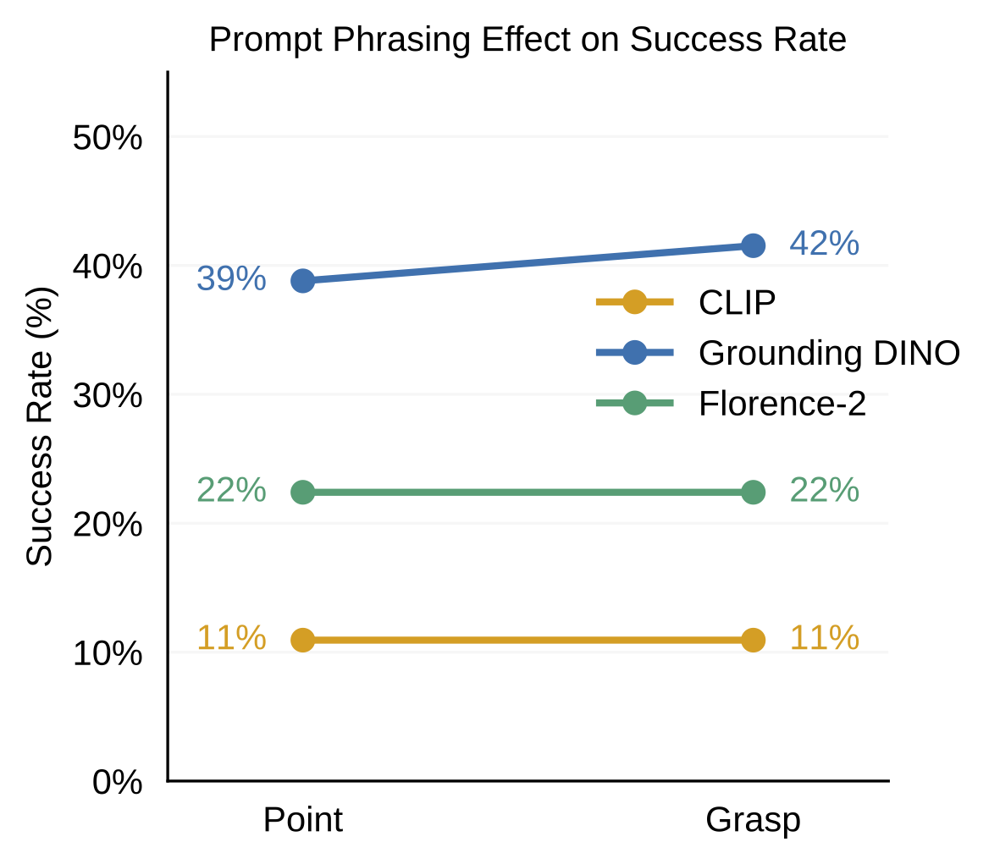

**Figure 7:** Success rate under two prompt phrasings for each model evaluated on the validation set.

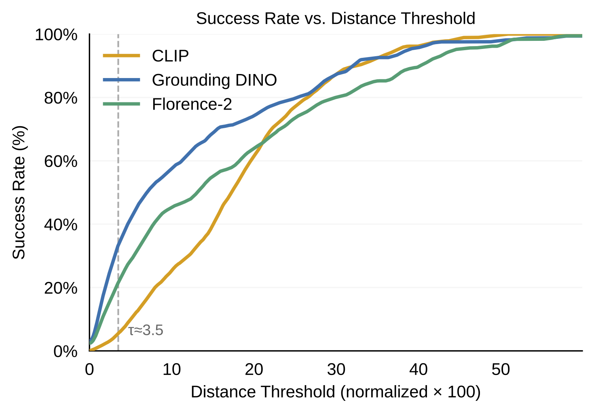

**Figure 8:** Success rate as a function of distance threshold for all three models on the test set.

### 4. Per-Category Breakdown

Per-category analysis revealed a shared limitation across all architectures: **small textureless objects** like earbuds, keys, and tape caused consistent failures. On the other hand, models excelled on large, distinctive geometries, with Grounding DINO demonstrating exceptional category-specific performance (achieving a **100% success rate on bottles**). This suggests object structure, rather than model architecture, is the primary determinant of baseline difficulty.

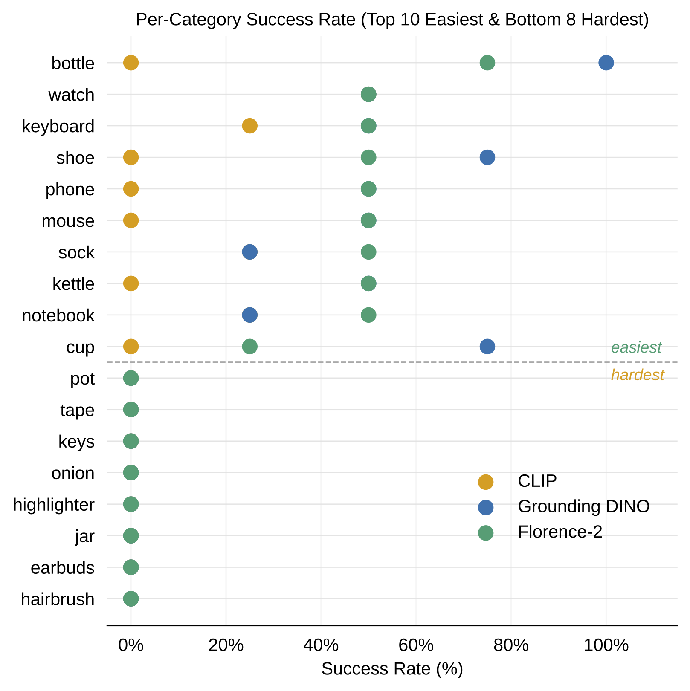

**Figure 9:** Per-category success rate for the 10 easiest and 8 hardest object categories, ranked by average success rate across all three models.

## 🎓 Academic Context

- **Course**: ENGR 521 A SP 26 Machine Learning for Engineering Project
- **Institution**: University of Washington
- **Program**: Graduate Certificate in Artificial Intelligence and Machine Learning for Engineering
- **Quarter**: Spring 2026

## 🤝 Acknowledgements
- **Dr. Michelle Hickner** - Assistant Teaching Professor, Department of Mechanical Engineering
- **Morgan Sanger** - Teaching Assistant
- **Zepu Wang** - Teaching Assistant
- [CLIP](https://github.com/openai/CLIP) — OpenAI
- [Grounding DINO](https://github.com/IDEA-Research/GroundingDINO) — IDEA Research
- [Florence-2](https://huggingface.co/microsoft/Florence-2-large) — Microsoft
- AI tools used for debugging

## 📚 Bibliography

[1] M. Hickner, *ENGR 521 A SP 26 Machine Learning for Engineering Project*. UW Canvas: Course Materials, 2026.

[2] M. Hickner, *ENGR 510 A AU 25 Foundations Of Machine Learning For Engineering*. UW Canvas: Course Materials, 2025.

[3] S. Fresca, *ENGR 515 A Wi 26 Data-Driven Optimization*. UW Canvas: Course Materials, 2026.

[4] S. Fresca, *ENGR 520 A Sp 26 Physics-Informed Machine Learning*. UW Canvas: Course Materials, 2026.

[5] S. L. Brunton and J. N. Kutz, *Data-Driven Science and Engineering: Machine Learning, Dynamical Systems, and Control*. Cambridge University Press, 2021.

[6] S. L. Brunton, "Optimization: A Bootcamp for Machine Learning, Inverse Problems, and Control." Course Manuscript, University of Washington, 2025.

[7] AllenAI, "pixmo-points," Hugging Face, 2024. [Online]. Available: [https://huggingface.co/datasets/allenai/pixmo-points](https://huggingface.co/datasets/allenai/pixmo-points)

[8] A. Radford et al., "Learning Transferable Visual Models From Natural Language Supervision," in *Proc. ICML*, 2021. [Online]. Available: [https://arxiv.org/abs/2103.00020](https://arxiv.org/abs/2103.00020)

[9] A. Dosovitskiy et al., "An Image is Worth 16x16 Words: Transformers for Image Recognition at Scale," in *Proc. ICLR*, 2021. [Online]. Available: [https://arxiv.org/abs/2010.11929](https://arxiv.org/abs/2010.11929)

[10] B. K. Rameshbabu, S. S. Balakrishna, B. Flynn, V. Kapoor, A. Norton, H. Yanco, and B. Calli, "A Benchmarking Study of Vision-based Robotic Grasping Algorithms," *arXiv preprint arXiv:2503.11163*, 2025. [Online]. Available: [https://arxiv.org/abs/2503.11163](https://arxiv.org/abs/2503.11163)

[11] S. Liu et al., "Grounding DINO: Marrying DINO with Grounded Pre-Training for Open-Set Object Detection," *arXiv preprint arXiv:2303.05499*, 2023. [Online]. Available: [https://arxiv.org/abs/2303.05499](https://arxiv.org/abs/2303.05499)

[12] B. Xiao et al., "Florence-2: Advancing a Unified Representation for a Variety of Vision Tasks," *arXiv preprint arXiv:2311.06242*, 2023. [Online]. Available: [https://arxiv.org/abs/2311.06242](https://arxiv.org/abs/2311.06242)

[13] Ultralytics, "How to Run Microsoft Florence-2 with Ultralytics for Visual Reasoning, OCR & Object Detection Tasks," 2025. [Online]. Available: [YouTube Video](https://www.youtube.com/watch?v=ojoYESWLw5Q) | [Colab Notebook](https://colab.research.google.com/github/ultralytics/notebooks/blob/main/notebooks/how-to-use-florence-2-for-object-detection-image-captioning-ocr-and-segmentation.ipynb) | [GitHub Repo](https://github.com/ultralytics/notebooks/blob/main/notebooks/how-to-use-florence-2-for-object-detection-image-captioning-ocr-and-segmentation.ipynb)

[14] A. Deshpande et al., "GraspMoLMo: Language-Guided Grasp Point Selection with Vision-Language Models," *arXiv preprint arXiv:2505.13441*, 2025. [Online]. Available: [https://arxiv.org/abs/2505.13441](https://arxiv.org/abs/2505.13441)

[15] G. Tziafas and H. Kasaei, "Towards Open-World Grasping with Large Vision-Language Models," *arXiv preprint arXiv:2406.18722*, 2024. [Online]. Available: [https://arxiv.org/abs/2406.18722](https://arxiv.org/abs/2406.18722)

[16] McKnight's Senior Living, "US healthcare spending for NFs and CCRCs to reach $337.4 billion by 2032, CMS says," [Online]. Available: [https://www.mcknightsseniorliving.com/news/us-healthcare-spending-for-nfs-and-ccrcs-to-reach-337-4-billion-by-2032-cms-says/](https://www.mcknightsseniorliving.com/news/us-healthcare-spending-for-nfs-and-ccrcs-to-reach-337-4-billion-by-2032-cms-says/)

[17] Atlassian, "Git Cheat Sheet," [Online]. Available: [https://www.atlassian.com/git/tutorials/atlassian-git-cheatsheet](https://www.atlassian.com/git/tutorials/atlassian-git-cheatsheet)
